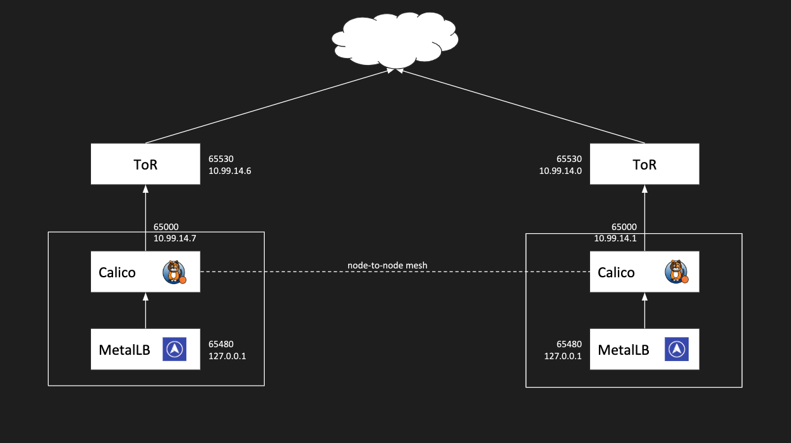

Kubernetes on Packet
====================

This guide can be used as a reference to deploy Kubernetes on Packet bare-metal servers in a single facility.

| Component  | Version |
| ---------- | ------- |
| Kubernetes | v1.15.3 |
| Calico     | v3.8    |
| MetalLB    | v0.8.1  |

Kubernetes Network:

| Network                  | Subnet           |
| ------------------------ | ---------------- |
| Pod subnet               | 172.16.0.0/12    |
| Service subnet           | 192.168.0.0/16   |

Packet Network:

| Network                  | Subnet                    |
| ------------------------ | ------------------------- |
| Packet Elastic IP(EWR1)  | 147.75.194.92/31(example) |

TL;DR
----

This will deploy a cluster of 3, 1 master and 2 worker nodes. It will allow you to use the service type `LoadBalancer`.

Make a copy of `terraform.tfvars.sample` as `terraform.tfvars`  and set the `auth_token`.

```sh
auth_token = "PACKET_AUTH_TOKEN"
facilities = ["ewr1"]
kubernetes_version = "1.14.1"
kubernetes_port = "6443"
kubernetes_dns_ip = "192.168.0.10"
kubernetes_cluster_cidr = "172.16.0.0/12"
kubernetes_service_cidr = "192.168.0.0/16"
```

```sh
terraform apply
```

You can now use the kubernetes service type `LoadBalancer` and you will be assigned a External IP.

For example we can deploy the traefik ingress and use that as our public load balancer.
Here we are using the `DaemonSet` deployment from the traefik [guide](https://docs.traefik.io/user-guide/kubernetes/).

We modified the Service by adding the `metallb.universe.tf/address-pool: packet-public` annotation and type to use `type: LoadBalancer` like so:

```yaml
kind: Service
apiVersion: v1
metadata:
  name: traefik-ingress-service
  namespace: kube-system
  annotations:
    metallb.universe.tf/address-pool: packet-public
spec:
  selector:
    k8s-app: traefik-ingress-lb
  ports:
    - protocol: TCP
      port: 80
      name: web
    - protocol: TCP
      port: 8080
      name: admin
  type: LoadBalancer
```

This results into this:

```sh
$ kubectl get svc -n kube-system
NAME                      TYPE           CLUSTER-IP       EXTERNAL-IP      PORT(S)                       AGE
kube-dns                  ClusterIP      192.168.0.10     <none>           53/UDP,53/TCP                 11m
traefik-ingress-service   LoadBalancer   192.168.60.102   147.75.193.148   80:32358/TCP,8080:32196/TCP   7s
````

Overall Network Topology
------------------------



BGP on Packet uses the private `/31` IPv4 network to peer with. 

As an example in the diagram above the server has the IP `10.99.14.7/31` assign on the server and the gateway is `10.99.14.6/31`, which is the IP your would peer with since that is the IP assigned to the ToR router.

Kubeadm
-------

We will be using kubeadm to bootstrap the Kubernetes cluster.

To start we will be deploying a single master server with 3 workers.
We do not want to expose the Kubernetes components over the public internet and because of how the interface and network setup at Packet is we have to make this clear in out config as it by default will listen on all IPs/interfaces.

Example kubeadm.yaml:

[Link](kubeadm.conf.md)

NOTE: In kubeadm v1.13.3 it seems like the `KubeProxyConfiguration` configs are not being read correctly and so the kube-proxy is not using the `bindAddress` and so listening on all IPs of the server.

```sh
# Setup the first master
kubeadm init --config kubeadm-config.yaml
```

Take note of the resulting `kubeadm join` command

Run the `kubeadm join` command on the nodes you to add to this cluster.

e.g.

```sh
kubeadm join 10.99.14.9:6443 --token tcqfab.8d5qen6tf2gaztam --discovery-token-ca-cert-hash sha256:9843f4de7165fb6edf141e0a35a4d815cdb318a6eba1a45fb85376d01fe8f382
```

Kubernetes Network Setup
------------------------

Packet has private ASNs setup for users to use.

ASN:

- 65530: Private Packet ToR
- 65000: Private Packet Server
- 65480: Private MetalLB

Issues:

[MetalLB cannot peer with BGP routers that Calico is already peering with](https://github.com/google/metallb/issues/114)

- To work around this we make it so that `bird` does not listen on the loopback if there is something configured by setting `passive on` in `bird`

### Calico

We will be using the Calico [Kubernetes API datastore—50 nodes or less](https://docs.projectcalico.org/v3.5/getting-started/kubernetes/installation/calico#installing-with-the-kubernetes-api-datastore50-nodes-or-less) setup for both policy and networking.

Since we are not using the typical Kubernetes Pod CIDR, `192.168.0.0/16`, and we are adding a custom `bird` template we have to change the manifest a bit.

```sh
# Download the Calico Manifest
curl -O \
https://docs.projectcalico.org/v3.5/getting-started/kubernetes/installation/hosted/kubernetes-datastore/calico-networking/1.7/calico.yaml

# Change the Pod CIDR
POD_CIDR="172.16.0.0/12" \
sed -i -e "s?192.168.0.0/16?$POD_CIDR?g" calico.yaml
```

To get the latest calico bird templates:

```sh
# List all the templates
kubectl exec calico-node-kvb9d -n kube-system -- /bin/ls -l /etc/calico/confd/templates

# Copy a template locally
kubectl cp \
  kube-system/calico-node-kvb9d:etc/calico/confd/templates/bird.cfg.template \
  bird.cfg.template
```

[Calico Custom BGP config](https://docs.tigera.io/v2.3/usage/custom-bgp-config)

You will need to edit the Global peers section in `bird.cfg.template` to make it so `bird` does not listen on the loopback IP.
If there is someone else trying to listen on that IP, in this case MetalLB will be listening on 127.0.0.1.

You will need to add this line:

```sh
{{if eq $data.ip ("127.0.0.1")}}passive on; # Don't talk to yourself{{end}}
```

[GitHub Calico Issue](https://github.com/projectcalico/calico/issues/1603)

[GitHub MetalLB Issue](https://github.com/google/metallb/issues/114)

TODO: example calico config yaml.

```sh
...
# ------------- Global peers -------------
{{if ls "/global/peer_v4"}}
{{range gets "/global/peer_v4/*"}}{{$data := json .Value}}
{{$nums := split $data.ip "."}}{{$id := join $nums "_"}}
# For peer {{.Key}}
{{- if eq $data.ip ($node_ip) }}
# Skipping ourselves ({{$node_ip}})
{{- else}}
protocol bgp Global_{{$id}} from bgp_template {
  {{if eq $data.ip ("127.0.0.1")}}passive on; # Don't talk to yourself{{end}} <======== Add this line here
  neighbor {{$data.ip}} as {{$data.as_num}};
{{- if and (eq $data.as_num $node_as_num) (ne "" ($node_cluster_id)) (ne $data.rr_cluster_id ($node_cluster_id))}}
  rr client;
  rr cluster id {{$node_cluster_id}};
{{- end}}
}
{{- end}}
{{end}}
{{else}}# No global peers configured.{{end}}
...
```

Apply the config

```sh
kubectl create configmap calico-metallb-bird -n kube-system --from-file=bird.cfg.template
```

We will leave Calico doing the default node-to-node mesh but will add another peer which will be to our servers ToR (Top of the Rack) router.

First get the `calicoctl` binary

```sh
# Download the matching version
curl -O -L  https://github.com/projectcalico/calicoctl/releases/download/v3.5.0/calicoctl

# Make it executable
chmod +x calicoctl

# If you like you can move it to a valid PATH
mv calicoctl /usr/local/bin/calicoctl
```

Set a default BGP configuration for Calico

```sh
cat << EOF | DATASTORE_TYPE=kubernetes KUBECONFIG=~/.kube/config calicoctl create -f -
apiVersion: projectcalico.org/v3
kind: BGPConfiguration
metadata:
  name: default
spec:
  logSeverityScreen: Info
  nodeToNodeMeshEnabled: true
  asNumber: 65000
EOF
```

Setup the generic MetalLB BGP peer

```sh
cat << EOF | DATASTORE_TYPE=kubernetes KUBECONFIG=~/.kube/config calicoctl create -f -
apiVersion: projectcalico.org/v3
kind: BGPPeer
metadata:
  name: metallb
spec:
  peerIP: 127.0.0.1
  asNumber: 65480
EOF
```

You will need to define the IP Pools we will setup with MetalLB in Calico as well,
in order for Calico to know they are allowed in the filter ACL

Examples:

```sh
cat << EOF | DATASTORE_TYPE=kubernetes KUBECONFIG=~/.kube/config calicoctl create -f -
apiVersion: projectcalico.org/v3
kind: IPPool
metadata:
  name: metallb-ewr1-public
spec:
  cidr: 139.178.64.136/31
  disabled: true
EOF
```

```sh
cat << EOF | DATASTORE_TYPE=kubernetes KUBECONFIG=~/.kube/config calicoctl create -f -
apiVersion: projectcalico.org/v3
kind: IPPool
metadata:
  name: metallb-global-ips
spec:
  cidr: 147.75.40.8/32
  disabled: true
EOF
```

```sh
cat << EOF | DATASTORE_TYPE=kubernetes KUBECONFIG=~/.kube/config calicoctl create -f -
apiVersion: projectcalico.org/v3
kind: IPPool
metadata:
  name: metallb-ewr1-private
spec:
  cidr: 10.99.110.128/25
  disabled: true
EOF
```

We will also need Calico to peer with each of our servers ToR Router which requires a per node config

Setup the BGP peers for each worker node.

Example Calico peer config:

```sh
cat << EOF | DATASTORE_TYPE=kubernetes KUBECONFIG=~/.kube/config calicoctl create -f -
apiVersion: projectcalico.org/v3
kind: BGPPeer
metadata:
  name: ewr1-worker-0
spec:
  peerIP: 10.99.14.7
  node: ewr1-worker-0
  asNumber: 65530
EOF
```

```sh
cat << EOF | DATASTORE_TYPE=kubernetes KUBECONFIG=~/.kube/config calicoctl create -f -
apiVersion: projectcalico.org/v3
kind: BGPPeer
metadata:
  name: ewr1-worker-1
spec:
  peerIP: 10.99.14.6
  node: ewr1-worker-1
  asNumber: 65530
EOF
```

### MetalLB

> Kubernetes does not offer an implementation of network load-balancers ([Services of type LoadBalancer](https://kubernetes.io/docs/tasks/access-application-cluster/create-external-load-balancer/)) for bare metal clusters. The implementations of Network LB that Kubernetes does ship with are all glue code that calls out to various IaaS platforms (GCP, AWS, Azure…). If you’re not running on a supported IaaS platform (GCP, AWS, Azure…), LoadBalancers will remain in the “pending” state indefinitely when created.
> Bare metal cluster operators are left with two lesser tools to bring user traffic into their clusters, “NodePort” and “externalIPs” services. Both of these options have significant downsides for production use, which makes bare metal clusters second class citizens in the Kubernetes ecosystem.
> MetalLB aims to redress this imbalance by offering a Network LB implementation that integrates with standard network equipment, so that external services on bare metal clusters also “just work” as much as possible.
>
> \- [Why MetalLB?](https://metallb.universe.tf/#why)

At Packet there is no load balancing service provided and so we need to find another way to expose our services via the traditional `LoadBalancer` service type. To achieve this we use the BGP to the server feature.

```sh
kubectl apply -f https://raw.githubusercontent.com/google/metallb/v0.7.3/manifests/metallb.yaml
```

Example MetalLB config file:

```yaml
apiVersion: v1
kind: ConfigMap
metadata:
  namespace: metallb-system
  name: config
data:
  config: |
    peers:
    - peer-address: 127.0.0.1
      peer-asn: 65000
      my-asn: 65480
    address-pools:
    - name: ewr1-public
      protocol: bgp
      addresses:
      - 147.75.194.92/30
    - name: ewr1-private
      protocol: bgp
      addresses:
      - 10.99.110.128/25
    - name: global-ip
      protocol: bgp
      addresses:
      - 147.75.40.8/32
```

NOTE: After this is setup the master will have its calico-node as not ready becuase it is not peering with anything on 127.0.0.1 even though it's set to passive.

```sh
$ kubectl get pod -n kube-system -o wide | grep calico-node
calico-node-9pls6                           1/1     Running   0          7h47m   10.99.14.5   ewr1-worker-0       <none>           <none>
calico-node-cgcbb                           1/1     Running   0          7h47m   10.99.14.7   ewr1-worker-1       <none>           <none>
calico-node-wz4x4                           0/1     Running   0          7h47m   10.99.14.9   ewr1-controller-0   <none>           <none>
```

It is not peering with MetalLB becuase the metallb-speakers do not run on the master.

```sh
$ kubectl get pod -n metallb-system -o wide
NAME                          READY   STATUS    RESTARTS   AGE     IP           NODE            NOMINATED NODE   READINESS GATES
controller-7cc9c87cfb-q6hh4   1/1     Running   0          7h16m   172.16.1.4   ewr1-worker-0   <none>           <none>
speaker-jrzlc                 1/1     Running   0          7h16m   10.99.14.7   ewr1-worker-1   <none>           <none>
speaker-qgvp5                 1/1     Running   0          7h16m   10.99.14.5   ewr1-worker-0   <none>           <none>
```

Everything works though and the node-to-node mesh is also fine.

```sh
root@ewr1-controller-0:~# calicoctl node status
Calico process is running.

IPv4 BGP status
+---------------+-------------------+-------+----------+-------------+
| PEER ADDRESS  |     PEER TYPE     | STATE |  SINCE   |    INFO     |
+---------------+-------------------+-------+----------+-------------+
| 147.75.74.155 | node-to-node mesh | up    | 21:35:48 | Established |
| 147.75.106.51 | node-to-node mesh | up    | 21:35:48 | Established |
| 127.0.0.1     | global            | start | 03:33:18 | Passive     |
+---------------+-------------------+-------+----------+-------------+

IPv6 BGP status
No IPv6 peers found.
```

[kubectl Cheat Sheet](https://kubernetes.io/docs/reference/kubectl/cheatsheet/)
